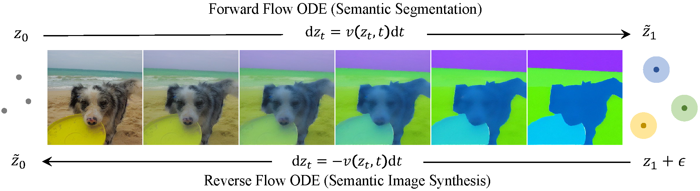

# SemFlow: Binding Semantic Segmentation and Image Synthesis via Rectified Flow


<div align="center">

[](https://arxiv.org/abs/2405.20282)
[](https://wang-chaoyang.github.io/project/semflow)

</div>

<div>
  <p align="center" style="font-size: larger;">
    <strong>NeurIPS 2024</strong>
  </p>
</div>

<p align="center">

<p>

## Requirements

1. Install `torch==2.1.0`.
2. Install other pip packages via `pip install -r requirements.txt`.
3. Our model is based on [Stable Diffusion v1.5](https://huggingface.co/runwayml/stable-diffusion-v1-5), please download and put it into `dataset/pretrain`.

## Demo

We provide a [demo](scripts/demo.py) for visualizing the bidirectional generation capability of the model. First, download the [checkpoint](https://huggingface.co/chaoyangw/semflow/resolve/main/face.pt). Then, rename it as `diffusion_pytorch_model.bin` and put it into `demo/unet`. Finally, copy `stable-diffusion-v1-5/unet/config.json` to `demo/unet`.


```
# mask2image

python scripts/demo.py --pretrain_model dataset/pretrain/stable-diffusion-v1-5 --valmode gen --ckpt demo/unet --im_path file/img.jpg --mask_path file/mask.png

# image2mask

python scripts/demo.py --pretrain_model dataset/pretrain/stable-diffusion-v1-5 --valmode seg --ckpt demo/unet --im_path file/img.jpg --mask_path file/mask.png
```

## Data Preparation
Please download the datasets from [CelebAMask-HQ](https://github.com/switchablenorms/CelebAMask-HQ), [COCOStuff](https://github.com/nightrome/cocostuff), [Cityscapes](https://www.cityscapes-dataset.com/). Put them under `dataset` and rearrange as follows.

```
dataset
├── celebAmask
│   ├── CelebA-512-img
│   ├── CelebAMask-HQ-mergemask 
│   └── metas
├── cityscapes
│   ├── gtFine
│   ├── leftImg8bit 
│   └── metas
└── cocostuff
    ├── annotations
    │   ├── train2017
    │   └── val2017
    ├── metas
    │   ├── train.txt
    │   └── val.txt
    ├── train2017 
    └── val2017
```

We specify the training and testing data with indices, which are recorded in `metas/train.txt` and `metas/val.txt`. The indices should look like follows,

```
aachen/aachen_000000_000019 # cityscapes
000000000285 # cocostuff
0 # celebAmask
```

## Training Scripts

The [script](scripts/semrf.py) is launched by accelerate. The saved path is specified by `env.output_dir`. 
```
# run
accelerate launch --multi_gpu --num_processes [GPUS] scripts/semrf.py [CONFIG] [PY_ARGS]
```
You can also use `deepspeed` and `bf16` to reduce the usage of VRAM.
```
accelerate launch --multi_gpu --num_processes [GPUS] scripts/semrf.py [CONFIG] env.mixed_precision=bf16 env.deepspeed=true [PY_ARGS] 

```


## Citation

If you find SemFlow useful for your work, please kindly consider citing our paper:

```bibtex
@article{wang2024semflow,
  author = {Wang, Chaoyang and Li, Xiangtai and Qi, Lu and Ding, Henghui and Tong, Yunhai and Yang, Ming-Hsuan},
  title = {SemFlow: Binding Semantic Segmentation and Image Synthesis via Rectified Flow},
  journal = {arXiv},
  year = {2024}
}
```

## License

MIT license