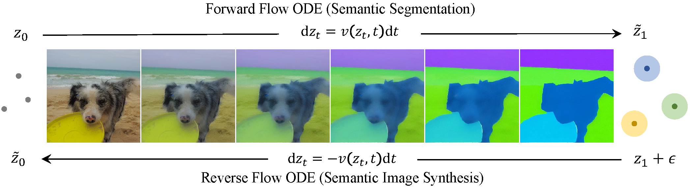
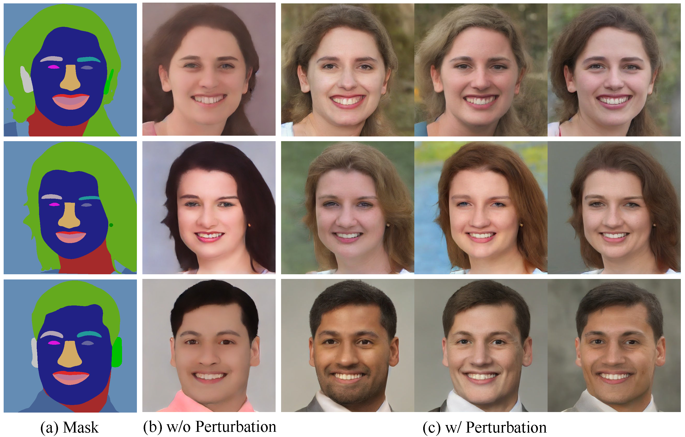

<div align="center">

<h1>SemFlow: Binding Semantic Segmentation and Image Synthesis via Rectified Flow</h1>

<div>
    <a href='https://wang-chaoyang.github.io/' target='_blank'>Chaoyang Wang</a><sup>1</sup>&emsp;
    <a href='https://lxtgh.github.io/' target='_blank'>Xiangtai Li</a><sup>2</sup>&emsp;
    <a href='http://luqi.info/' target='_blank'>Lu Qi</a><sup>3</sup>&emsp;
    <a href='https://henghuiding.github.io/' target='_blank'>Henghui Ding</a><sup>2</sup>&emsp;
    <a href='https://scholar.google.com/citations?user=T4gqdPkAAAAJ' target='_blank'>Yunhai Tong</a><sup>1</sup>&emsp;
    <a href='https://scholar.google.com/citations?user=p9-ohHsAAAAJ' target='_blank'>Ming-Hsuan Yang</a><sup>3</sup>
</div>
<div>
    <sup>1</sup>PKU, <sup>2</sup>NTU, <sup>3</sup>UC Merced
</div>

<div>
    <h4 align="center">
        • <a href="https://arxiv.org/abs/2405.20282" target='_blank'>[arXiv]</a> •
    </h4>
</div>

</div>


## Introduction

<div style="text-align:center">

</div>

We present SemFlow, a unified framework that binds semantic segmentation and image synthesis via rectified flow. Samples belonging to the two distributions (images and semantic masks) can be effortlessly transferred reversibly.

For semantic segmentation, our approach solves the contradiction between the randomness of diffusion outputs and the uniqueness of segmentation results. 

For image synthesis, we propose a finite perturbation approach to enable multi-modal generation and improve the quality of synthesis results.

## Visualization

### Semantic Segmentation
<div style="text-align:center">

</div>


### Semantic Image Synthesis
<div style="text-align:center">


</div>

## Citation
If you find this work useful for your research, please consider citing our paper:
```bibtex
@article{wang2024semflow,
  author = {Wang, Chaoyang and Li, Xiangtai and Qi, Lu and Ding, Henghui and Tong, Yunhai and Yang, Ming-Hsuan},
  title = {SemFlow: Binding Semantic Segmentation and Image Synthesis via Rectified Flow},
  journal = {arXiv preprint arXiv:2405.20282},
  year = {2024}
}
```

## License

MIT license